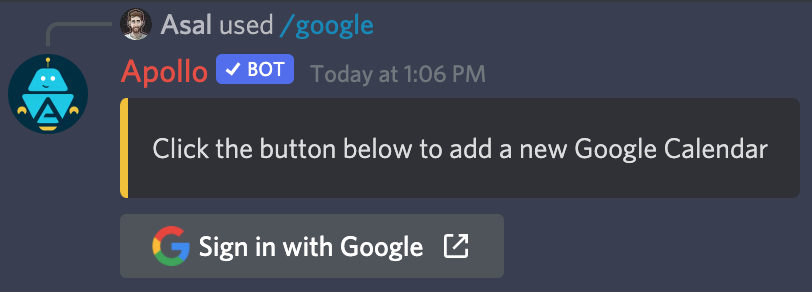
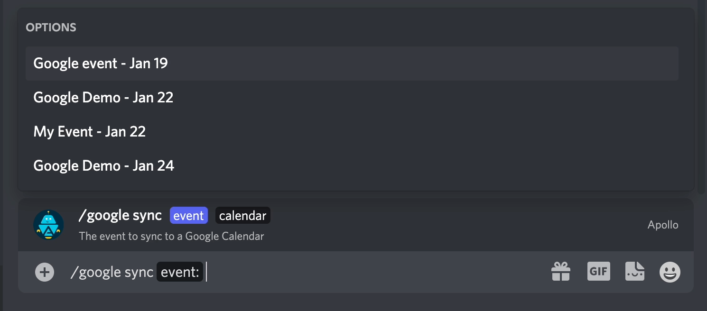

# Google Calendar

Apollo's Google Calendar integration allows you to sync events to a
Google Calendar of your choice.

## Connect a calendar

Any user can connect a Google Calendar to Apollo with the `/google authorize`
command.

<figure markdown>
  { width="600" style="border-radius:5px" }
  <figcaption>Authorize a new Google Calendar</figcaption>
</figure>

After issuing the command, click the **Sign in with Google** button and follow
the prompts in your browser.

Once your Google Calendar has been connected, Apollo will send you a direct
message indicating that you're ready to start syncing events.

## Syncing events

Users are permitted to sync any event they can see in Discord to any of their
connected calendars.

To sync an event, use the `/google sync` command, which will ask for the
following information:

- The event you'd like to sync
- The Google Calendar to sync the event to

<figure markdown>
  { width="800" style="border-radius:5px" }
  <figcaption>Sync an event to Google Calendar</figcaption>
</figure>

!!! Tip
    If you don't see the event you'd like to sync, start typing the name of it
    to filter down the list.

Once synced, Apollo will provide a link to the event in your Google Calendar.

### Automatically sync events

With an active [Premium](https://apollo.fyi/premium) membership, Apollo can be
configured to automatically sync all newly posted events to a predefined Google
Calendar.

Admins can set an auto sync calendar with `/google auto_sync set`, and can
disable it with `/google auto_sync disable`.

!!! Info
    If the user who authorized the auto sync calendar revokes access, auto
    sync will be disabled.

## Disconnect a calendar

To disconnect a calendar, use the `/google revoke` command and select the name
of the calendar you'd like to disconnect.
