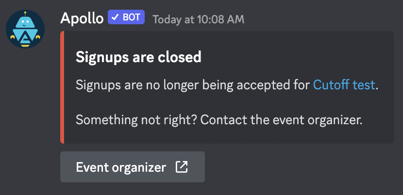

# Signup Restrictions

With an active [Premium](https://apollo.fyi/premium) subscription, Apollo can
be configured to restrict event signups. Signup restrictions allow you to
ensure that unwanted users aren't signing up for events, and that users aren't
modifying their signups when they shouldn't be.

There are two types of restrictions:

- Discord roles permitted to signup
- Time based signup cutoff times

!!! Info
    Regardless of what event restrictions are in place, the event organizer
    (or an admin) can always manually modify user signups.

## Discord role restrictions

A Discord role restriction is a _whitelist_ of Discord roles that are permitted
to signup for an event. A user needs _one of_ the roles listed to qualify for
the event.

Role restrictions can exist at the event level and at the signup option level.
Event level restrictions apply to all signup options, while signup option level
restrictions apply only to the corresponding signup option.

!!! Info
    If both event and signup option restrictions are in place, the user must
    pass both checks. In other words, the user needs to have _one of_ the
    even level restricted roles, and _one of_ the signup option level
    restricted roles.

### Set event level restrictions

At the last step of event creation, select the option to restrict signups to
certain roles. Follow the prompts, and enter the names of the Discord roles
required to signup for the event.

### Set signup option level restrictions

Restrictions can be set individually for each signup option. During event
creation,

## Signup cutoff

A signup cutoff can be put in place, where after a specified time, users will
no longer be able to add, remove, or otherwise modify their response.

Signups can be set to cutoff:

- When the event starts; or
- A period of time before the event starts; or
- A period of time after the event starts

If a user attempts to signup for an event that is closed, they'll receive a
message from Apollo indicating that signups are closed. The message will link
to the event organizer's profile so the user knows who to contact about any issues.

<figure markdown>
  { width="800" style="border-radius:5px" }
  <figcaption>A notification that signups are closed</figcaption>
</figure>

### Set a cutoff time

To set a time for signups to cutoff, select the option to set a time for
signups to close at the last step of event creation.
